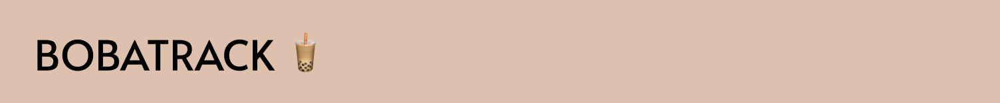

# BobaTrack
----------
# Note
Deployment strategies: run 'npm install' to download dependencies, and use npm run start in the console to run web page on port 8888.
Please test using the dimensions of Macbook desktop & with width of 600px for mobile view. 

Please refer to the comments on the index.html, script.js, style.css, server.js and package.json for further details on the development process. 

----------
# Testing final high fidelity iteration:
Following the web design assignment on my boba tracking application, I received iteration advice from tutors and friends.

Overall, users said that my boba tracking application was unique, as they haven't seen anything like this before, which made it a novel design. It was simple and straightforward to use for different screen sizes.

*High fidelity drawing on Figma & previous data model*

*Pictures of user interviews of my web designs*

*User quotes from user testing*

----------
# Iteration 1: Input Feedback and reset button

I decided to not add the tick and untick icons that were next to each label heading. Instead, by using 'id required = true' for each form-row, it ensures that users fill out everything before submitting. If not all the parts are filled out, a pop up notification would show on the form which guides users to know which places need to be filled out. 

One of the reasons was because user research revealed that the tick and cross was a bit fiddly and didn't really match the brown shades of my web application. Furthermore, it makes the page look less clunky and makes each section more clear.  

Adding the reset button allows the users to start their tracking from scratch which enhances accessibility, instead of going into each section and deleting the inputs. 

*Before iteration - Input Feedback and reset button*

*After iteration - Input Feedback and reset button*

----------
# Iteration 2: Backgound Image

Instead of the plain beige background colour in my initial web app design, I decided to put a background image in attempt to bind the 2 static sections - Bobatrack form & Tracked boba orders - with each other to look more cohesive. Users liked the background image as it made the tracked look more lively and inviting to use. 

I chose this background specifically because it had a combination of different brown shades of rounded shapes - wavy lines and circles, which I thought represented milk tea and the boba pearls. 

*Before iteration - Background Image*

*After iteration - Background Image*

----------

# Iteration 3: Font

I used Futura as my font for my web app prototype. Although this font was similar with the previous 'Lexend' font used in the web app design as they both use sans serifs, I felt that Futura was more bolded and more readable. Especially with the thin lines in the background image, I felt that the bolded letter help to stand out and contrast more, improving visible accessibility. To keep my web app look cohesive, I made sure only Futura was used to make it look more consistent. To distinguish the headings and the body text, bolded and size typography were used to create hierarchy within the web app (Interaction Design Foundation, N.a.) https://www.interaction-design.org/literature/topics/visual-hierarchy. 

*Lexend font used in previous iteration* 

*Futura font used in current prototype* 

----------
# Iteration 4: Borders
Thicker borders were used (0.2rem) on the container boxes on my web app. This was due to legibility - users thought that since the font was very bolded, and in combination with the background that has thin lines, it would be more legible to have thicker borders on each of the containers. To maintain consistency, all rounded edged input boxes / containers of the web app have the same border width, rounded radius, and border colour, which makes my web app look more cohesive. 

*Before adding borders* 

*After adding borders*

----------
# Iteration 5: Mascot Icon
As boba tea drinkers usually consist of a young adult population, I added a mascot icon to make it more appealing to the target audience. Having a mascot icon for this web app brings this brand to life, allows users to quickly associate boba tea with my app, and strengthen social prescence (BLND PR, 2023). I chose a corgi as the mascot, as it was cute - and many other boba tea brands such as Coco, Gotcha, and Machi Machi also have used cute branding mascots, which have also been successful. https://blndpr.com/blog/how-important-is-a-brand-mascot/#:~:text=Mascots%20are%20the%20storytellers%20of,bring%20your%20brand%20to%20life. 

*Before adding Mascot* 

*After added Mascot (corgi)*

----------
# Iteration 6: Autogenerated Images

Finally, insights from users (students and tutors) revealed that the Tracked Boba Orders section felt like looking at a pure text section, which felt boring to look at. In my prototype, I tried to make it look more visual by adding emojis (eg. ⭐️ to represent rating), and also added an autogenerated image function where each time a user submits a boba order on the form, a cute image would appear next to their order. Having the autogenerated image, gives a little surprise to the users, and the random generation of cute icon images aim to motivate users to keep using the boba tracker. 

*Old datedelete section* 

*New date delete section with cute icon images* 

----------
# Further improvements and considered recommendations
My data model did not change much, as most users thought that these sections were enough. However, some users did say that it could be better to have more options to tick from - for example, have a list of toppings where users could pick from. I did not incorporate this feedback into my current prototype, due to the complicated nature of boba tea orders. Next time I could enable a fruit / milk tea option, or even allow users to pick the ice and sweetness levels, or even have 2 sections - where users can either type their order, or tick from a range of options. In this way, it gives users the freedom to choose how they would like to track their boba tea orders - accommodates to a range of specific ~ general boba tea orders. 

*Adding more options to pick from in the bobatrackform*

Furthermore, next time it would helpful to have a confirm submission of the boba orders, which I wanted to implement, but did not have enough time to do so. Although, there is a delete and reset button, usability could be improved by having a submit confirmation button to ensure that users want to submit that order, otherwise they would have to delete their tracked order and retype their entire order again, which would be time inefficient.  

*Confirm submision button*

If I had more time, I would have also made my Tracked Boba Order section into a card format instead of expandable sections. It would be more visual this way - users can click on the card (which consists of the image and boba order name), and more details about the order would pop up. Initially I didn't do this because I thought it would be difficult to code an exact picture of users' input boba tea order, as users' boba tea orders can vary in complexities. 

*Card Format of Tracked Boba order*

*Users click on the card to expand more details of the tracked boba order*

----------
# References used 

BLND PR (2023). How Important is a Brand Mascot? https://blndpr.com/blog/how-important-is-a-brand-mascot/#:~:text=Mascots%20are%20the%20storytellers%20of,bring%20your%20brand%20to%20life.

Coyier, C. (2013 April 8). A Complete Guide to Flexbox. https://css-tricks.com/snippets/css/a-guide-to-flexbox/

Crozier, J. (2013 Sep 25). How can I get Input Radio Elements to Horizontally Align. https://stackoverflow.com/questions/19014766/how-can-i-get-input-radio-elements-to-horizontally-align

DesignTorch. (2020, March 19). How To Make Custom Radio Buttons With Cool Effect | Pure CSS | DesignTorch [Video]. Youtube. https://www.youtube.com/watch?v=GZh52Fh8o1o&ab_channel=DesignTorch

Dongas, R. (2023, March 13). JS Objects - Input and Event handling [Video]. Scrimba. https://scrimba.com/scrim/coa064ba08c96c1639bc9531b

Dongas, R. (2023, March 27). Week 6 Content - Tutorial Content [Text]. Canvas. https://canvas.sydney.edu.au/courses/48447/pages/week-6-content?module_item_id=1922213

Dongas, R. (2023, May 1). Local Storage - Tasklist [Video]. Scrimba. https://scrimba.com/scrim/cEr7veuE

Googlesearchsentmehere. (2011, February 8). CSS: Setting background-image in CSS. https://stackoverflow.com/questions/649576/css-setting-background-image-in-css

Interaction Design Foundation (N.A.). Visual Hierarchy. https://www.interaction-design.org/literature/topics/visual-hierarchy

Leniolabs_LLC (2023). Layoutit! https://grid.layoutit.com/

Learning Loop. (2023). Input Prompt. https://ui-patterns.com/patterns/InputPrompt

MDN Contributors (2023, April 12). Intl.DateTimeFormat. https://developer.mozilla.org/en-US/docs/Web/JavaScript/Reference/Global_Objects/Intl/DateTimeFormat

Shadeed, A. (2020, Apr 19). Spacing in CSS. https://ishadeed.com/article/spacing-in-css/

Thomas, G. (2021). Create A Button in Javascript.https://herewecode.io/blog/create-button-javascript/#:~:text=To%20create%20a%20button%20in%20JavaScript%2C%20you%20must%20use%20the,button%20element%20const%20button%20%3D%20document.

W3Schools (2023). HTML Input Types. https://www.w3schools.com/html/html_form_input_types.asp

W3Schools (2023). HTML Responsive Web Design. https://www.w3schools.com/html/html_responsive.asp

W3Schools (2023). JavaScript Random. https://www.w3schools.com/js/js_random.asp

# Images used

catalyststuff (N.A.). Cute corgi drink milk tea boba cartoon vector illustration. animal drink concept isolated vector. flat cartoon style [Graphic]. In freepik.com. https://www.freepik.com/free-vector/cute-corgi-drink-milk-tea-boba-cartoon-vector-illustration-animal-drink-concept-isolated-vector-flat-cartoon-style_10336142.htm#query=boba&position=6&from_view=search&track=sph

catalyststuff (N.A.). Cute koala hug boba milk tea cup cartoon icon illustration. flat cartoon style [Graphic]. In freepik.com. https://www.freepik.com/free-vector/cute-koala-hug-boba-milk-tea-cup-cartoon-illustration_14877510.html

catalyststuff (N.A.). Cute monkey with boba milk tea cartoon vector icon illustration. animal drink icon concept isolated premium vector. flat cartoon style [Graphic]. In freepik.com. https://www.freepik.com/free-vector/cute-monkey-with-boba-milk-tea-cartoon-vector-icon-illustration-animal-drink-icon-concept-isolated-premium-vector-flat-cartoon-style_17121078.htm#query=boba&position=10&from_view=author

catalyststuff (N.A.). Cute panda hug boba milk tea cartoon icon illustration. animal drink icon concept premium. flat cartoon style[Graphic]. In freepik.com. https://www.freepik.com/free-vector/cute-panda-hug-boba-milk-tea-cartoon-icon-illustration-animal-drink-icon-concept-premium-flat-cartoon-style_12571361.htm#query=panda%20boba&position=0&from_view=keyword&track=ais

catalyststuff (N.A.). Cute rabbit boba milk tea cartoon icon illustration [Graphic]. In freepik.com. https://www.freepik.com/free-vector/cute-rabbit-boba-milk-tea-cartoon-icon-illustration_12617373.htm#query=boba&position=2&from_view=author

renata.s. (N.A.). Abstract wavy background in light brown [Graphic]. In freepik.com. https://www.freepik.com/free-vector/abstract-wavy-background-light-brown_16303873.htm

